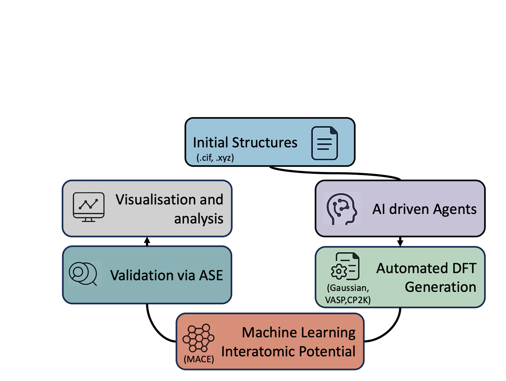

The Automated Machine Learning Pipeline (AMLP) provides an integrated framework that unifies the entire workflow from dataset creation to model validation. It leverages large language model (LLM) agents to assist with electronic-structure code selection, thereby reducing the manual effort typically required. AMLP also incorporates automated dataset tools for efficient input generation—including geometry (or cell) optimizations and ab initio molecular dynamics (AIMD)—as well as output conversion and preparation of data in the MACE-compatible format. It supports three DFT packages—Gaussian, VASP, and CP2K—ensuring flexibility across different electronic-structure environments. Its analysis module, AMLP-Analysis (built on ASE), further supports a broad range of molecular simulations, enabling systematic evaluation and validation of machine learning interatomic potentials.

## Table of Contents
- [Multi-Agent DFT Research System](#multi-agent-dft-research-system)
  - [Overview](#overview)
  - [Features](#features)
  - [Installation](#installation)
  - [API Configuration](#api-configuration)
  - [Usage](#usage)
- [AMLP-analysis: Automated Machine Learning Pipeline - Analysis Module](#amlp-analysis-automated-machine-learning-pipeline---analysis-module)
  - [What Can AMLP-Analysis Do?](#what-can-amlp-analysis-do)
  - [Getting Started with AMLP-Analysis](#getting-started-with-amlp-analysis)
  - [How to Use AMLP-Analysis](#how-to-use-amlp-analysis)
- [Batch Evaluation Tool](#batch-evaluation-tool)
  - [Features](#evaluation-features)
  - [Usage](#evaluation-usage)
  - [Key Options](#key-options)

## Automated Machine Learning Pipeline

### Overview

The Automated Machine Learning Pipeline use multi-agent DFT research system as an integrated framework that combines:

1. **AI-driven research analysis** - Uses specialized AI agents to analyze research topics and generate summaries
2. **DFT code expertise** - Provides expert recommendations for Gaussian, VASP, and CP2K simulations
3. **Input file generation** - Efficiently processes crystallographic structures for DFT calculations
4. **Output data processing** - Extracts and formats simulation results for analysis or ML model training

### Features

#### 🤖 AI-Agent Research Assistance

AMLP includes multiple AI agents to assist with different aspects of computational chemistry research:

- **Experimental Chemist Agent**: Summarizes and interprets experimental aspects of research topics.  
- **Theoretical Chemist Agent**: Analyzes theoretical foundations and computational methodologies.  
- **DFT Expert Agents**: Specialized agents for Gaussian, VASP, and CP2K that provide code-specific recommendations.  
- **Supervisor Agents**: Integrate information from all agents and generate comprehensive reports.  

#### 📝 Input Generation
- **Multi-code support**: Generate inputs for CP2K, VASP, and Gaussian
- **Batch processing**: Convert multiple structure files automatically
- **Format conversion**: Process CIF and XYZ files with validation
- **Supercell creation**: Build supercells with custom dimensions
- **Interactive guidance**: Step-by-step parameter selection for DFT calculations

#### 📊 Output Processing
- **DFT output extraction**: Extract energies, forces, and coordinates from simulation results
- **ML-ready dataset creation**: Convert DFT outputs to HDF5 format for machine learning potentials
- **AIMD processing**: Generate AIMD inputs from optimized structures at multiple temperatures

### 📥 Installation

#### Requirements
- Python 3.8+
- Required Python packages:
  - NumPy
  - PyYAML
  - ASE (Atomic Simulation Environment, optional but recommended)
  - openai (for AI agent functionality)
  - requests

#### Setup
1. Clone the repository:
```
git clone https://github.com/adamlaho/AMLP.git
cd AMLP
```

2. Install dependencies:
```
pip install -r requirements.txt
```

### API Configuration

The AI agents in this system use OpenAI's API for text generation. Follow these steps to configure API access:

1. **Get API Key**:
   - Sign up for an account at [OpenAI Platform](https://platform.openai.com/)
   - Navigate to the API keys section and create a new secret key
   - Copy the key (you will not be able to view it again)

2. **Set Environment Variable**:
   
   🔑 The system looks for the API key in the `OPENAI_API_KEY` environment variable:
   ```bash
   # On Linux/macOS
   export OPENAI_API_KEY="your-api-key-here"
   
   # On Windows
   set OPENAI_API_KEY=your-api-key-here
   ```

3. **Model Configuration**:
   
	By default, the agents use predefined settings. These can be customized in the configuration file:
	```yaml
	AMLP/multi_agent_dft/config/default_config.yaml
	```
	In this file, you can adjust:
		•	The type of AI models (e.g., OpenAI models).
		•	PublicationAPI parameters.
		•	Other runtime conditions for agent behavior.

4. **Usage Monitoring**:
   - Be aware of your [OpenAI API usage limits](https://platform.openai.com/account/limits)
   - The AI agent functionality will consume tokens based on the length of inputs and outputs
   - The system implements basic retry logic for API rate limiting (3 attempts with exponential backoff)

### Usage

#### Basic Usage
Run the main script to start the system:
```
python3 amlpt.py
```

The system will present a menu with five operation modes:
1. AI-agent feedback (research summaries & reports)
2. Input generation (CP2K/VASP/Gaussian)
3. Output processing (extract forces, energies, coordinates)
4. ML potential dataset creation (JSON to MACE HDF5)
5. AIMD processing (JSON to CP2K AIMD inputs)

#### AI-Assisted Research Workflow

This mode helps you explore research topics with AI assistance:

1. Enter a research topic or question
2. The system will refine your query and analyze literature
3. Review reports from Experimental and Theoretical Chemist agents
4. Examine DFT-specific recommendations from expert agents
5. Use the generated reports to guide your computational research

Example:
```
Enter your research topic or question: Metal oxide catalysts for water splitting
```


#### Structure File Support

The system supports the following structure file formats:
- **CIF** (Crystallographic Information File)
- **XYZ** (Cartesian coordinates)

#### 📝 Input Generation for Cell and Geometry optimizations

Generate input files for DFT calculations using either batch mode or guided mode:

##### Batch Mode
Automatically convert all supported files using default templates:
```
Batch-mode: which DFT code? (CP2K/VASP/Gaussian): cp2k
Path to file or directory: ./structures
Output directory: ./cp2k_inputs
```

##### Guided Mode
Step through detailed parameter selection for your DFT calculation:
```
Which DFT code? (CP2K/VASP/Gaussian): VASP
```

#### 📊 Output Processing

Extract data from DFT calculation outputs:
```
Select DFT code (1/2/3): 1
Path to CP2K input file (.inp): ./cp2k_calcs/input.inp
Path to CP2K output file: ./cp2k_calcs/output.out
Path for output JSON file [output_data.json]: results.json
```

#### 🔥 AIMD Input Generation

Generate AIMD inputs from optimized structures at multiple temperatures based on the cell/geo. optimization .json output processed file:
```
Path to your JSON file or directory: ./optimized_structures
Output directory for generated files: ./aimd_inputs
Select template (1-5) [1]: 2
```


#### 🧮 ML Dataset Creation

Convert DFT outputs to machine learning potential training data:
```
Full path to JSON file containing DFT data: ./results/dft_data.json
Output directory for HDF5 datasets [current directory]: ./ml_datasets
Dataset base name [dft_data]: water_system
```


#### Output Files

Depending on the mode, the system generates:
- **CP2K**: .inp input files
- **VASP**: INCAR, POSCAR, KPOINTS, and POTCAR files in subdirectories
- **Gaussian**: .com 
- **Research Reports**: .txt 
- **Processed Data**: .json and .h5 data files

#### Troubleshooting

##### API-Related Issues

1. **Authentication Errors**: Verify your API key is correct and properly set in the environment or config file
2. **Rate Limiting**: If you see `RateLimitError`, the system will automatically retry with exponential backoff
3. **Model Not Available**: Ensure you're using a model that's available to your API key level

##### Common Issues

1. **File validation errors**: Check if your CIF or XYZ files follow standard format
2. **Missing cell parameters**: Ensure cell information is properly defined for periodic systems
3. **ASE import errors**: Install ASE for full functionality: `pip install ase`

## AMLP-analysis: Automated Machine Learning Pipeline - Analysis module

AMLP-A is a tool that helps you analyze atomic structures using machine learning. It combines several analysis methods into one easy workflow:
- ⚡ Single Point calculation
- 🔄 Geometry optimization
- 📦 Cell optimization
- 🌡️ Molecular dynamics simulations with different ensembles 
- 📈 Structural analysis (RDF, coordination and Energy drift)

### What Can AMLP-Analysis Do?

- **Use Pre-trained Models**: Works with MACE machine learning potentials
- **Run Multiple Analyses**: Perform different analyses in a single workflow
- **Easy Configuration**: Change simulation settings using a simple YAML file
- **Reproducible Research**: Get consistent results for scientific work

### Getting Started with AMLP-Analysis

#### System Requirements
- Python 3.7 or newer (Python 3.9 recommended)
- Required packages: numpy, matplotlib, pyyaml, torch, tqdm, scipy, ase, mace-torch

### How to Use AMLP-Analysis

Run the main analysis script:
```bash
python3 amlpa.py <input_file.xyz> config.yaml
```

### Configuration Guide

Create a `config.yaml` file to customize your analysis. Here's what you can configure:

#### Basic Settings
```yaml
base_name: 'acridine_test'
output_dir: './test_results'
```

#### Structure Settings
```yaml
# Cell parameters
readcell_info: true              # Try to read cell from XYZ header
cell_params: null                # Fallback: [a, b, c, alpha, beta, gamma]
pbc: true                        # Enable periodic boundary conditions

# CELL REPLICATION 
replicate_initial: true #false         # Set to true to test supercell
replicate_dims: [2, 2, 1]       # Integer factors or [true, true, false] for 2D

# System settings
pbc: True                         # Use periodic boundaries?
```
#### Calculator settings (MACE)
```yaml
device: 'gpu'                    # 'gpu' or 'cpu'
gpus: ['cuda:0']                 # GPU devices list
model_paths: 
  - '/path/of/your/own/model'
```
Use your own MACE potential or you can also use the foundation models from MACE on this website https://github.com/ACEsuit/mace-mp

#### Analysis Options

##### Simulation and Analysis tasks (Enable/Disable)
```yaml
single_point: false                # Single point energy calculation
geo_opt: false                    # Geometry optimization
cell_opt: false                  # Cell optimization 
run_rmsd: false                   # RMSD analysis after optimization
run_coordination: false           # Coordination number analysis
run_energy_drift: true            # Energy drift analysis (NVE only)
```

##### 🔄 Geometry Optimization
```yaml
optimizer: 'BFGS'                # Options: BFGS, LBFGS, FIRE
fmax: 0.05                       # Force convergence (eV/Å) - relaxed for quick test
# Normally use fmax: 0.001 for production
```

##### 📦 Cell optimization settings
```yaml
cell_optimizer: 'BFGS'           # Options: BFGS, LBFGS, FIRE
cell_fmax: 0.05                  # Stress convergence (eV/Å) - relaxed for quick test
scalar_pressure: 0.0             # Target pressure (GPa)
```

##### 🌡️ Molecular Dynamics
Run MD at multiple temperatures to test different features:
- Use NVE at one temperature to test energy drift analysis
- Use other thermostats at other temperatures to test thermostat functionality
```yaml
temperatures: [300]              # List of temperatures (K) to simulate
md_steps: 1000                   # Total MD steps 
timestep: 1.0                    # MD timestep (fs)
save_interval: 50                # Save trajectory every N steps
log_interval: 50                 # Log of the simulations
```

##### Thermostat selection
Options: 'nve', 'langevin', 'berendsen', 'nose-hoover' (or 'nh')
- 'nve': Microcanonical ensemble (constant N, V, E) Use this to test energy conservation and drift analysis
- 'langevin': Canonical ensemble with stochastic dynamics
- 'berendsen': Canonical ensemble with velocity rescaling (NEW)
- 'nose-hoover': Canonical ensemble with deterministic thermostat
```yaml
thermostat: 'berendsen'
# Thermostat-specific parameters (only used when applicable)
friction: 0.01                   # Langevin friction coefficient (1/time)
taut: 100.0                      # Berendsen time constant (fs) 
# Nosé-Hoover specific parameters
nh_tdamp: 50.0        # Damping time in fs (recommended: 100 × timestep)
nh_tchain: 3          # Chain length (longer = better canonical ensemble)
nh_tloop: 1           # Sub-steps (higher = more accurate but slower)
energy_drift_start_time_ps: 0.1  # Skip initial equilibration (ps) only for NVE

```
---

## Thermodynamic Integration (Lambda-Static TI)

Computes free energy differences between the physical MACE potential and an Einstein crystal reference via lambda-static TI.

---

### Coupling Schemes

**Standard TI** (Kirkwood 1935):

$$U(\lambda) = \lambda\,U_\text{phys} + (1-\lambda)\,U_0, \qquad \frac{\partial U}{\partial\lambda} = U_\text{phys} - U_0$$

**REG TI** — default (Kapil, *J. Chem. Phys.* **164**, 051101, 2026):

$$U(\lambda) = \lambda^m U_\text{phys} + (1-\lambda)^m U_0, \qquad \frac{\partial U}{\partial\lambda} = m\left[\lambda^{m-1}U_\text{phys} - (1-\lambda)^{m-1}U_0\right]$$

---

### Reference Potential

The reference is an Einstein crystal optionally augmented with an intramolecular force field:

$$U_0(\mathbf{q}) = U(\mathbf{q}_0) + \frac{\kappa}{2}\sum_i|\mathbf{r}_i - \mathbf{r}_i^0|^2 + \Delta U_\text{FF}(\mathbf{q})$$

where $\Delta U_\text{FF} = U_\text{FF}(\mathbf{q}) - U_\text{FF}(\mathbf{q}_0)$ is the intramolecular FF contribution shifted to zero at $\mathbf{q}_0$. When `intramolecular_ff` is disabled, $\Delta U_\text{FF} = 0$. MIC is applied to Einstein displacements when PBC are active.

> **Prerequisite:** `geo_opt: true` must be enabled so that $\mathbf{q}_0$ is defined before any TI run.

If `einstein_kappa` is not set, it is auto-fitted from a short NVT pre-run via equipartition:

$$\kappa = \frac{3k_\text{B}T}{\langle|\mathbf{r}_i - \mathbf{r}_i^0|^2\rangle}$$

The fitted $\kappa$ is cached and reused across all $\lambda$ windows at the same temperature.

---

### Intramolecular Force Field

An OpenFF/GAFF force field can be included in $U_0$ to improve overlap with the physical potential, reducing TI variance. The FF is evaluated via OpenMM and runs on GPU.

Key implementation details:

- **PBC unwrapping:** BFS-based molecular unwrapping using ASE `find_mic` on the primitive (pre-replication) cell, so cross-boundary corrections are found exactly for any supercell size.
- **Per-molecule topology:** Graph isomorphism permutations are computed independently per molecule, correctly handling symmetry-distinct orientations in low-symmetry space groups (e.g. P2₁/c).
- **H-bond constraints** (`fix_hbonds: true`): X–H bond stretching terms are removed from the FF energy and replaced by OpenMM rigid constraints, reducing high-frequency noise in $\partial U/\partial\lambda$.

---

### Output

Each window writes a log to `results/ti_trajectories/ti_lambda<X.XXXX>_<T>K.log` with columns:

| Column | Description |
|---|---|
| `Step` / `Time(ps)` | MD step and simulation time |
| `E_phys` / `E0` | Physical and Einstein crystal energies (eV) |
| `E_lambda` | Mixed Hamiltonian energy (eV) |
| `dH_dlambda` | TI integrand $\partial U/\partial\lambda$ (eV) |
| `Temp(K)` / `FNorm` | Instantaneous temperature and RMS force norm |

Mean and std of $\langle\partial U/\partial\lambda\rangle$ are appended as a summary at the end of each log. Integration over $\lambda$ to obtain $\Delta F$ is performed by `ti_analysis.py`.

---

### Caching

Each $\lambda$ window is cached independently. Re-running with identical parameters (`structure`, `lambda_values`, `temperatures`, `md_steps_per_lambda`, `mode`, `m`) loads results from cache, skipping the MD entirely. The fitted $\kappa$ is also cached per temperature.

---

### Configuration

```yaml
thermodynamic_integration:
  enabled: true
  mode: 'reg_ti'                # 'reg_ti' (recommended) or 'standard_ti'
  m: 6                          # REG TI exponent
  lambda_values: [0.0, 0.1, 0.2, 0.3, 0.4, 0.5, 0.6, 0.7, 0.8, 0.9, 1.0]
  temperatures: [300]           # K
  md_steps_per_lambda: 50000
  equilibration_steps: 5000     # discarded in ti_analysis.py
  ti_save_interval: 20
  # einstein_kappa: 2.5         # eV/Ų — leave unset to auto-fit (recommended)
  kappa_fit_steps: 2000
  kappa_sample_interval: 10

  intramolecular_ff:
    enabled: true
    ff_type: 'openff-2.2.1'             # or 'gaff2'
    mol_smiles: 'c1ccc2nc3ccccc3cc2c1'  # acridine; or use mol_sdf_file
    n_molecules: 32                     # must match simulation supercell
    zero_at_reference: true             # shift FF to zero at q0
    fix_hbonds: true                    # constrain X–H bonds (recommended)
    openmm_platform: 'CUDA'
```

> The thermostat is set via the top-level `thermostat` key.


##### 📈 Radial Distribution Function Analysis settings
RDF uses the SIMULATION cell 
- Cutoff is automatically validated: rmax <= 0.5 * min(cell_length)
-  Atom pairs for RDF analysis
-  Format: list of [type1, type2] pairs
```yaml
atom_pairs:
  - ['N', 'N']
  - ['C', 'N']
  - ['C', 'C']
# RDF parameters
rdf_rmin: 0.5                    # Minimum distance (Å)
rdf_rmax: 8.0                    # Maximum distance (Å) (will be auto-validated against cell size)
rdf_nbins: 100                   # Number of histogram bins
rdf_nframes: 50                  # Number of frames to sample from trajectory
                                 # Use null to analyze all frames
# RDF smoothing for plots
rdf_smoothing_sigma: 1.0         # Gaussian smoothing sigma (0 = no smoothing)
```


##### 📈 Coordination Analysis
```yaml
coordination_cutoff: 3.0         # Cutoff distance for neighbor counting (Å)
coordination_atom_types: 'all'   # Analyze all atoms, or specify ['N', 'C']
```

## Batch Evaluation Tool

GPU-accelerated batch inference tool for MACE models with efficient parallel processing and progress tracking.

### Evaluation Features

- ⚡ **GPU Batch Processing**: Process multiple structures simultaneously
- 🔢 **Modes**: Energy-only (`e`), energy+forces (`ef`), or full (`efs`)
- 🗂️ **Directory Support**: Automatically process all `.xyz`/`.cif` files
- 💾 **Memory Efficient**: Configurable batch sizes

### Evaluation Usage

Located in `multi_agent_dft/utils/batch_evaluate_gpu.py`
```bash
python3 multi_agent_dft/utils/batch_evaluate_gpu.py \
  --model path/to/model.model \
  --configs path/to/structures/ \
  --output results.xyz \
  --device cuda \
  --compute ef \
  --compute_density \
  --batch_size 40
```

### Key Options
```
--model MODEL              Path to MACE model
--configs CONFIGS          Input file or directory (.xyz/.cif)
--output OUTPUT            Output file (.xyz)
--device {cpu,cuda}        Device (default: cpu)
--compute {e,ef,efs}       Energy/forces/stress (default: ef)
--batch_size N             Structures per batch (default: 32)
--default_dtype {float32,float64}  Precision (default: float64)
--verbose                  Detailed output
--compute_density 		   Compute density
```


## Contributing

Contributions are welcome! Fork the repository and submit pull requests with improvements or bug fixes. For major changes, please open an issue first to discuss your ideas.

## License

[MIT License](LICENSE)

## Acknowledgments

- This project utilizes several open-source packages including ASE, NumPy, PyYAML, and MACE
- DFT code parameters are based on best practices from the computational chemistry community
- The AI agent system utilizes OpenAI's GPT models for text generation

**Disclaimer:** Parts of this project are currently under active development. All features, APIs, and documentation may change as new functionalities are implemented and improvements are made.

## Citation

If you use this code or data in your research, please cite:

```bibtex
@article{lahouari2025amlp,
  author = {Lahouari, Adam and Rogal, Jutta and Tuckerman, Mark E.},
  title = {Automated Machine Learning Pipeline: Large Language Models-Assisted Automated Data set Generation for Training Machine-Learned Interatomic Potentials},
  journal = {Journal of Chemical Theory and Computation},
  year = {2025},
  doi = {10.1021/acs.jctc.5c01610},
  note = {Article ASAP},
  url = {https://doi.org/10.1021/acs.jctc.5c01610}
}


